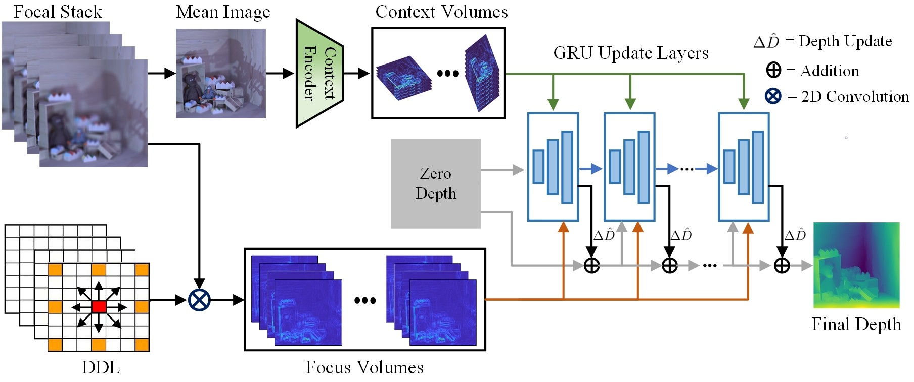

<h1 align="center">Robust Shape from Focus via Multiscale Directional Dilated Laplacian and Recurrent Network</h1>

  <strong><a href="https://khurramashfaq.github.io/">Khurram Ashfaq</a> and Muhammad Tariq Mahmood</strong> 
  <strong>International Journal of Computer Vision (IJCV), 2026</strong>

## Paper Links: [Springer](https://link.springer.com/article/10.1007/s11263-025-02596-z) | [arXiv](https://arxiv.org/pdf/2512.10498)

---

---

## Data

By default, `config.py` expects the datasets to be placed in the following locations.

### FlyingThings3D (FT)

Training:
- `data/FT/train`

Validation or testing:
- `data/FT/val`

Download:
- https://drive.google.com/file/d/19n3QGhg-IViwt0aqQ4rR8J3sO60PoWgL/view

After downloading, extract and place the contents so the paths above exist.

### Focus on Defocus (FoD)

Dataset root:
- `data/FoD`

Download:
- https://drive.google.com/file/d/1bR-WZQf44s0nsScC27HiEwaXPyEQ3-Dw/view

After downloading, extract and place the contents inside `data/FoD`.

---

## Requirements

Tested with the following packages:

- PyTorch 2.2.0
- PIL (Pillow)
- OpenEXR
- numpy
- matplotlib
- tqdm
- timm

---

## Testing

Pretrained checkpoints for both **FT** and **FoD** datasets are provided in the `checkpoints/` folder.  
After placing the datasets in the expected locations and confirming paths in `config.py`, run:

- `testckpt_FT.py` for FlyingThings3D (FT)
- `testckpt_FoD.py` for Focus on Defocus (FoD)

---
